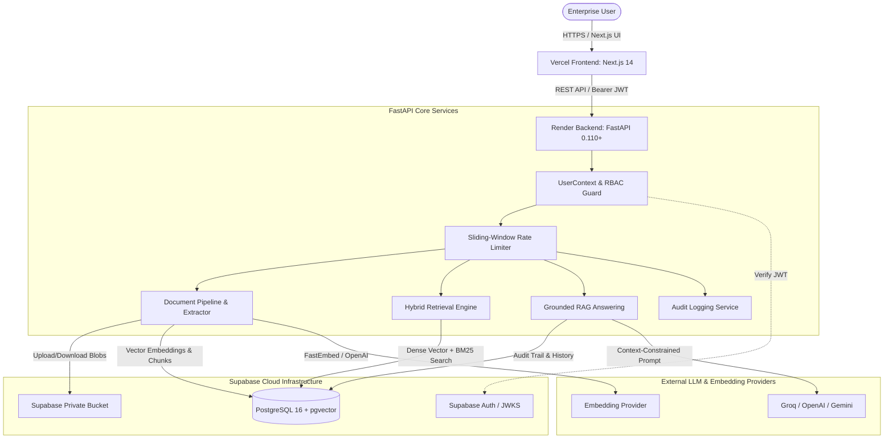

# KnowFlow AI — Architecture Specification

## 1. System Architecture Overview

KnowFlow AI is structured as a decoupled multi-tier enterprise RAG system consisting of:
- **Presentation Tier**: Next.js 14 App Router, React Server & Client Components, TypeScript, Tailwind CSS, hosted on **Vercel** (`https://knowflow-ai-pied.vercel.app`).
- **Application & Ingestion Tier**: Python 3.11, FastAPI, Async SQLAlchemy, Pydantic v2, hosted on **Render** (`https://knowflow-ai-4ssd.onrender.com`).
- **Data & Vector Storage Tier**: Managed PostgreSQL 16 on **Supabase** with the `pgvector` extension for 384-dimensional dense embeddings.
- **Identity & Blob Storage**: Supabase Auth (GoTrue) for JWT issuance/JWKS validation and Supabase Storage for encrypted private document blobs.



---

## 2. Ingestion Pipeline & Chunking Engine

```mermaid
sequenceDiagram
    autonumber
    actor User as Client
    participant API as FastAPI /documents/upload
    participant Storage as Supabase Storage
    participant Worker as Background Task
    participant Extractor as Document Extractor
    participant Embedder as FastEmbed / OpenAI
    participant DB as PostgreSQL + pgvector

    User->>API: POST multipart/form-data (File + Metadata)
    API->>API: Validate file type, MIME, and size (<= 25MB)
    API->>Storage: Store raw file in private bucket (path: workspace_id/doc_id_name)
    API->>DB: INSERT into documents (status: 'PROCESSING')
    API-->>User: HTTP 201 Created (document_id)
    
    API->)Worker: Trigger background ingestion (document_id)
    Worker->>Storage: Download raw file bytes
    Worker->>Extractor: Extract text & structure (PDF/DOCX/TXT/MD/CSV)
    Worker->>Worker: Semantic sliding chunker (500 tokens, 10% overlap)
    Worker->>Embedder: Generate 384-dim dense vectors
    Worker->>DB: INSERT document_chunks (embedding, content, page, heading)
    Worker->>DB: UPDATE documents (status: 'READY', page_count, total_chunks)
```

---

## 3. Hybrid Retrieval & Reranking Subsystem

The retrieval pipeline blends dense vector search with sparse lexical scoring:
1. **Dense Retrieval (Semantic Meaning)**: pgvector cosine distance query:
   $$\text{sim}_{\text{dense}}(q, c) = 1 - (q_{\text{embed}} \cdot c_{\text{embed}})$$
2. **Sparse Retrieval (Exact Keyword & Acronyms)**: BM25 / PostgreSQL full-text search index matching exact part numbers, standard IDs, and domain terminology.
3. **Reciprocal Rank Fusion (RRF)**: Merges the top-$K$ dense and sparse results:
   $$\text{RRF\_Score}(d) = \sum_{m \in \{\text{dense}, \text{sparse}\}} \frac{1}{k + \text{rank}_m(d)}, \quad k = 60$$
4. **Hybrid Reranker**: Low-latency linear combination combining normalized similarity with keyword density prior to context construction.

---

## 4. Multi-Tenant Isolation & RBAC Matrix

Isolation is maintained through foreign key associations tied to `workspace_id` across all relational tables:
- `workspaces`
- `workspace_members`
- `documents`
- `document_chunks`
- `conversations`
- `messages`
- `audit_logs`

### RBAC Hierarchy

| Role | Allowed Document Clearance | Can Upload | Can Delete | Workspace Admin |
|---|---|---|---|---|
| **ADMIN** | `PUBLIC`, `INTERNAL`, `CONFIDENTIAL`, `RESTRICTED` | Yes | Yes | Yes |
| **COMPLIANCE_OFFICER** | `PUBLIC`, `INTERNAL`, `CONFIDENTIAL` | Yes | No | No |
| **MANAGER** | `PUBLIC`, `INTERNAL`, `CONFIDENTIAL` | Yes | Own Docs | No |
| **EMPLOYEE** | `PUBLIC`, `INTERNAL` | Yes | Own Docs | No |
| **AUDITOR** | `PUBLIC`, `INTERNAL` (Read-only audit logs) | No | No | No |
